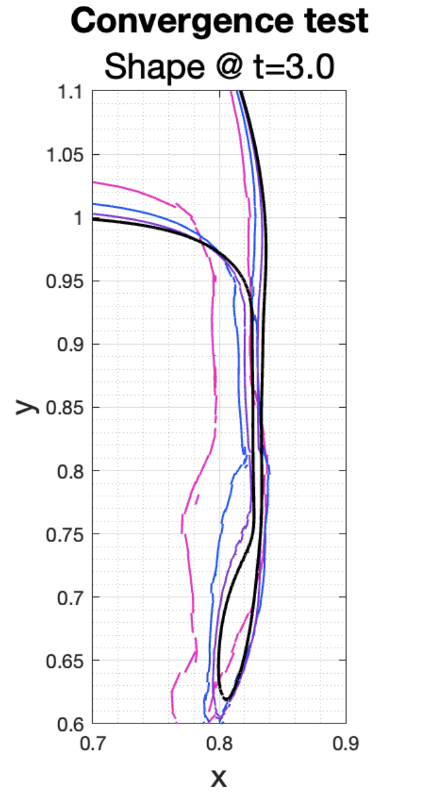

Certainly! Here’s a `README.md` based on your provided LaTeX document:

---

# Rising.c: A Basilisk Simulation

## Overview

This repository contains the code for simulating the rise of air bubbles in water using the **Basilisk** fluid simulation framework. The primary focus of this study is on the dynamics of the interaction between the bubble and the surrounding water, examining factors like convergence, refinement, and output velocity fields. Potential developments in the code are discussed, with the goal of improving computational efficiency and extending the range of analysis.

## Possible Developments

### 1. **Parallelization**
One possible enhancement for this simulation is the parallelization of the code. The current implementation relies on an outdated, serial function `mask` in the `rising.c` file. Replacing this function with a more recent, scalable one would significantly improve computational efficiency, especially for simulations with higher refinement levels. This update is essential for **CASE 2**, which is more computationally expensive than **CASE 1**.

### 2. **Convergence Study**
An interesting avenue for further exploration is the study of the code's convergence. Preliminary results show a convergence order between 1 and 2 when compared to the most refined simulation with `LEVEL = 10`. This may be due to the mixed Youngs-centered method not being fully second-order accurate. If an MPI (Message Passing Interface) implementation were available, running the simulation with `LEVEL = 11` could help confirm our convergence rate estimate. As it stands, `LEVEL = 9` and `LEVEL = 10` take approximately `10^4s` and `10^5s` to complete, respectively.

### 3. **Postprocessing Improvements**
For easier postprocessing, it would be helpful to compute the skirts' width directly within the `rising.c` code. Our results from the second test case with `LEVEL = 10` align with estimates provided by Guthrie (1967) and Legendre (2022), making it a promising direction for further analysis. 

### 4. **Output of Velocity Field**
Another area for improvement involves the study of the velocity field both inside and outside the bubble. This would allow us to observe the toroidal recirculation patterns behind the bubble. The following code snippet demonstrates how this can be implemented:

```c
event output_velocity_field_bubble(t = 3.0) {
    // Initialize the file-name with time-indexing
    char nameF[80];
    sprintf(nameF, "output_velocity_field_bubble", t);

    // Compute vorticity
    scalar vort[];
    vorticity(u, vort);

    static FILE * fp2;
    if (i == 0) {
        fp2 = fopen(nameF, "w");
        foreach() {
            fprintf(fp2, "%f %f %f %f %f %f\r\n", x, y, u.x[] * (1. - f[]),
                    u.y[] * (1. - f[]), p[] * (1. - f[]), vort[] * (1. - f[]));
        }
        fclose(fp2);
    } else {
        fp2 = fopen(nameF, "a");
        foreach() {
            fprintf(fp2, "%f %f %f %f %f %f\r\n", x, y, u.x[] * (1. - f[]),
                    u.y[] * (1. - f[]), p[] * (1. - f[]), vort[] * (1. - f[]));
        }
        fclose(fp2);
    }
}
```

### 5. **Bubble Shape Visualization**
For visualization, the shape of the rising bubble at different refinement levels can be plotted to understand how the bubble's characteristics change with increasing grid resolution. Below is an example of the bubble shape across different refinement levels:

{:width="800px"}

_Levels:_
- `LEVEL = 7`: pink
- `LEVEL = 8`: blue
- `LEVEL = 9`: purple
- `LEVEL = 10`: black

## References

- **Legendre (2022)**: D. Legendre, Free Rising Skirt Bubbles, *Physical Review Fluids*, vol. 7, n. 9, pag. 093601, 2022.
- **Guthrie (1967)**: R. I. L. Guthrie, Dynamic and MAS transfer phenomena of spherical capped bubbles, Ph.D. thesis, *Imperial College*, 1967.
- **Guthrie & Bradshaw (1969)**: R. I. L. Guthrie and A. V. Bradshaw, The stability of gas envelopes trailed behind large spherical cap bubbles rising through viscous liquids, *Chemical Engineering Science*, 24, 913, 1969.

## Requirements

- **Basilisk**: Make sure you have [Basilisk](http://basilisk.fr/) installed on your system.
- **C Compiler**: A C compiler like GCC for compiling the C code.
- **Python (optional)**: For data analysis and postprocessing.

## Running the Code

1. Clone the repository to your local machine:
   ```bash
   git clone https://github.com/your-username/rising.c.git
   cd rising.c
   ```

2. Compile the code using your preferred method (e.g., using `make` or directly with a C compiler):
   ```bash
   make
   ```

3. Run the simulation:
   ```bash
   ./rising.c
   ```

4. Postprocess the results as needed.

---

This `README.md` provides a clear overview of the code and its potential improvements, while also giving users the necessary instructions to run and understand the simulation. Let me know if you need further modifications!
